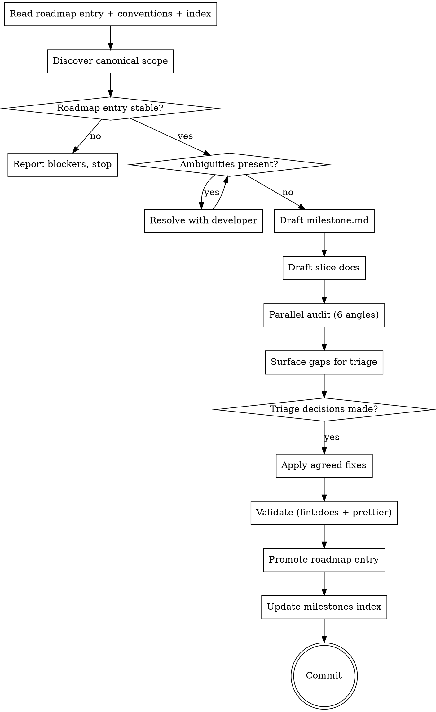

# Plan a milestone from a roadmap entry

Promote one planned milestone in `docs/implementation/roadmap.md`
into its full structure under `docs/implementation/milestones/NN-name/`
— authoring `milestone.md` and every slice doc under `slices/`,
then doing a parallel audit pass, surfacing gaps, applying agreed
fixes, shrinking the roadmap entry to a one-line pointer, updating
the milestones index, and committing.

**Announce at start:** "I'm using the aventuras-plan-milestone
skill to author milestone <M>."

<HARD-GATE>
This skill writes milestone + slice docs. It does NOT:

- Modify any canonical spec under `docs/data-model.md`,
  `docs/architecture.md`, `docs/generation-pipeline.md`,
  `docs/memory/`, `docs/ui/`, `docs/calendar-systems/`,
  `docs/observability.md`, `docs/tech-stack.md`, or `docs/conventions.md`.
  Canonical specs are gated through `aventuras-design`; if planning
  reveals a canonical spec must change, STOP and offer that route.
- Author implementation plans under `.impl-plans/`. That's
  `aventuras-writing-plans`. This skill stops at the slice doc.
- Promote a roadmap entry that's still ambiguous — if the roadmap
  entry's slice list reads provisional (`?` markers, "TBD",
  "might split into..."), surface that as the first finding and
  ask the user to firm up the entry before promotion.
- Commit without showing the audit findings + applied fixes to
  the user first.
</HARD-GATE>

## Invocation

Triggered as a slash command, with the target milestone as
argument:

- `/aventuras-plan-milestone M3` — plan milestone 3 (slug
  derived from roadmap entry heading)
- `/aventuras-plan-milestone M3 memory-floor` — plan with
  explicit slug override

The slug is kebab-case; the directory name is
`NN-<slug>` (zero-padded). E.g. `docs/implementation/milestones/03-memory-floor/`.

## Checklist

Create a task for each item; complete in order:

1. **Read inputs.** Roadmap entry + `docs/implementation/conventions.md`
   + `docs/implementation/README.md` + `docs/implementation/milestones/README.md`
   + every prior milestone's `milestone.md` (for prior-art shape).
2. **Discover canonical scope.** Open every canonical anchor the
   roadmap entry links to. Read the relevant sections — don't
   stop at the file. Inventory the capabilities that the
   milestone touches.
3. **Readiness check.** Is the roadmap entry stable enough to
   author against? If not, stop and report what's blocking.
4. **Resolve ambiguities.** Where canonical docs leave a planning
   decision unmade (dependency ordering, slice contract shape,
   scope split between adjacent slices), surface as a question to
   the user. One question at a time. Skip handholding for things
   the docs already settle.
5. **Draft milestone.md** under `docs/implementation/milestones/NN-slug/milestone.md`
   per [`conventions.md → Milestone doc structure`](../../../docs/implementation/conventions.md#milestone-doc-structure).
6. **Draft each slice doc** under `slices/NN-slug.md` per
   [`conventions.md → Slice doc structure`](../../../docs/implementation/conventions.md#slice-doc-structure).
7. **Parallel audit dispatch.** Six independent angles; see
   [Audit dispatch](#audit-dispatch). Run them concurrently.
8. **Surface gaps for triage.** Aggregate findings into one
   structured list; present to the user; await triage.
9. **Apply agreed fixes.** Apply what the user approves; skip
   what they reject; ask only when the fix is non-obvious.
10. **Validate.** `pnpm lint:docs` must pass clean. Prettier
    must be clean. If either fails, fix the underlying issue.
11. **Promote roadmap entry.** Shrink the roadmap section to a
    one-line pointer (per
    [`roadmap.md → How to read this doc`](../../../docs/implementation/roadmap.md#how-to-read-this-doc)).
12. **Update milestones index.** Append a row to
    `docs/implementation/milestones/README.md → Defined milestones`.
13. **Commit.** Single commit with message `plan: M<N> — <name> (milestone + slices)`.

## Process flow

## Phase 1 — Read inputs

Run in parallel:

- `docs/implementation/roadmap.md` — locate the target milestone's
  section.
- `docs/implementation/conventions.md` — milestone + slice
  templates. Authoritative on doc shape.
- `docs/implementation/README.md` — impl-tree index.
- `docs/implementation/milestones/README.md` — defined-milestones
  index (you'll append to it).
- Every prior milestone's `milestone.md` — for tone / shape
  precedent. Slice docs too if relevant.

Cross-cutting tables in `roadmap.md` ("Surfaces that ship
incrementally", "Subsystems that ship incrementally") often name
work that belongs in this milestone but isn't in the entry's
slice bullets. Capture both.

## Phase 2 — Discover canonical scope

For every canonical anchor the roadmap entry links to: open the
target section, read enough to understand what the milestone
delivers against that section. Recurse into anchors the section
itself cites if they're load-bearing for the milestone's work.

Stop discovery when you've read every doc the entry links and
every doc the cross-cutting tables flag for this milestone. Don't
go further — the spec is canonical, the milestone is the planning
layer; you're not redesigning anything.

Build an internal capability inventory:

- Every schema / type / table the milestone touches
- Every pipeline / agent / phase the milestone introduces
- Every UI surface the milestone ships (full or partial)
- Every contract spanning two or more slices in this milestone

## Phase 3 — Readiness check

A roadmap entry is **ready to promote** when:

- Its goal paragraph is stable (no `?` markers).
- Its slice list reads as titles + one-line goals (not
  "we might do X or Y").
- Its Gates field names a prior milestone that's already
  authored (or "M1 is the only prereq" for M2).
- Cross-cutting table entries that name this milestone
  semi-finalize the work attributed to it (not "M3 or M4 — TBD").

If any of these fail, stop and report. Don't try to firm up
ambiguity unilaterally — the user owns roadmap-entry shape.

## Phase 4 — Resolve ambiguities

Where canonical docs leave a planning decision unmade — a slice
contract shape, dependency ordering, scope split between adjacent
slices, whether a sub-system gets its own slice or folds in — ask
the user. One question at a time.

Skip:

- Anything the canonical doc clearly answers.
- Anything `conventions.md` clearly answers (template shape, doc
  conventions).
- Decisions the previous milestone has already made by precedent
  (e.g., "slice gating shape" — M1 sets the example).

Surface as multiple-choice when more than one resolution is
viable; lead with your recommendation + reasoning.

If a question requires a canonical-spec decision (not an
implementation choice), STOP and offer the
[`aventuras-design`](../aventuras-design/SKILL.md) route the way
`aventuras-brainstorming` does — do not invoke `aventuras-design`
yourself.

## Phase 5 — Draft milestone.md

Follow [`conventions.md → Milestone doc structure`](../../../docs/implementation/conventions.md#milestone-doc-structure)
exactly. Sections in order: Goal, Why now, Narrative / overview,
Slices, Dependency graph, Slice contracts, Definition of done,
Open questions.

- **Goal** — one short paragraph; stable once written.
- **Why now** — what this milestone unlocks, what depends on it,
  what it de-risks.
- **Narrative / overview** — how slices compose. A reader who
  reads only the narrative should understand what's being built
  without opening every slice. 1–3 paragraphs.
- **Slices** — one bullet per slice with one-line summary + link.
- **Dependency graph** — ASCII or prose, whichever is clearer.
  "Aspirational" is wrong; the binding declaration.
- **Slice contracts** — pin types / interfaces / behavioral
  boundaries that span more than one slice, so slices can be
  authored against a fixed boundary. Empty when sequencing
  dominates; see
  [`conventions.md → Sequencing vs doc-as-contract`](../../../docs/implementation/conventions.md#sequencing-vs-doc-as-contract).
- **Definition of done** — verifiable pass / fail criteria.
- **Open questions** — known-unknowns at milestone scope; slice-
  specific questions belong in the slice doc.

## Phase 6 — Draft each slice doc

Follow [`conventions.md → Slice doc structure`](../../../docs/implementation/conventions.md#slice-doc-structure)
exactly. Each slice doc:

- **Metadata** — Milestone link, Depends on, Blocks.
- **Goal** — concrete artefacts.
- **Background** — thin paraphrase, scoped to this slice.
- **Required reading** — named canonical anchors (e.g.
  `[data-model.md → Awareness links](../../../../data-model.md#awareness-links)`).
  Slice-doc paths are deep; verify each anchor against the
  canonical heading before saving.
- **Scope: in** — concrete deliverables.
- **Scope: out** — adjacent things that AREN'T in this slice.
- **Acceptance criteria** — verifiable; reviewer can check
  without asking the author.
- **Tests** — calibrated to the slice's risk profile.
- **Open questions** — slice-scoped known-unknowns.
- **Implementation notes** — optional; brief rationale, not a
  task checklist (those live outside `docs/`).

## Audit dispatch

After all docs are drafted but BEFORE any validation, lint
check, roadmap promotion, or commit — dispatch six parallel
subagents (`subagent_type=general-purpose`, model: `sonnet` or
better). Each agent gets the drafted `milestone.md` + every slice
doc path + a focused angle. Each returns a structured findings
list, not narrative.

- **Agent A — Scope coverage.** For every capability named in
  the canonical docs the milestone touches, find the slice it
  lands in. Flag capabilities not slotted, slotted ambiguously,
  or slotted to two slices.
- **Agent B — Dependency graph soundness.** Verify the milestone's
  dependency graph: every "Depends on" in a slice doc has a
  matching edge; no cycles; gates land before gated work in any
  topological ordering; cross-cutting tables in the roadmap that
  name this milestone are reflected in the graph.
- **Agent C — Slice contracts coverage.** Identify every
  type / interface / behavioral boundary that crosses two or
  more slices. Verify each is either pinned in `milestone.md
  → Slice contracts` or explicitly sequenced (first slice
  fixes the contract, second consumes it).
- **Agent D — Acceptance criteria verifiability.** For every
  slice's acceptance criterion, can a reviewer check it without
  asking the author? Flag generic / handwavy criteria
  ("works correctly", "tested"). Each criterion needs a named
  command, observable behavior, or specific test file.
- **Agent E — Required reading completeness.** For each slice's
  scope, verify the Required-reading list covers the canonical
  anchors the executing dev needs. Flag missing anchors and
  cited anchors that don't actually exist (heading mismatch).
- **Agent F — Conventions compliance.** Verify every doc
  follows `conventions.md` templates. Section ordering, naming,
  identifier conventions, link discipline. Flag mismatches
  against the canonical template.

Brief each agent with: (a) the working directory, (b) the
drafted doc paths, (c) the canonical doc paths for cross-check,
(d) the angle + finding shape (return structured findings, not
prose).

## Phase 7 — Surface gaps for triage

Aggregate findings from all six agents. Deduplicate. Sort by
class within impact:

- **Blocking** — milestone can't ship without resolution
  (missing slice, missing contract, broken dep graph).
- **Important** — should resolve but milestone is still
  coherent (unverifiable AC, missing required reading anchor).
- **Suggested** — polish / consistency (heading typo, naming
  drift).

Present the structured list to the user. Each finding gets a
location, description, and recommended fix. Ask the user which
to apply.

DO NOT auto-fix. Even mechanical-looking fixes go through the
user — the user explicitly chose "surface to me, I triage, then
it fixes." Apply only the fixes the user approves.

## Phase 8 — Apply fixes + validate + promote + commit

After triage:

1. Apply each approved fix. If a fix is non-obvious in shape,
   ask before applying.
2. Run `pnpm lint:docs`. If it fails, fix the underlying issue
   (broken anchors are usually heading typos). Do not silence.
3. Run `pnpm prettier --check` on the touched files. If it
   fails, run `pnpm prettier --write`, re-run lint. Watch for
   prose mangling per
   [`lessons-learned/prettier-prose-wrap-traps.md`](../../../docs/implementation/lessons-learned/prettier-prose-wrap-traps.md).
4. **Promote the roadmap entry.** Replace the milestone's section
   in `docs/implementation/roadmap.md` with a one-line pointer
   per
   [`roadmap.md → How to read this doc`](../../../docs/implementation/roadmap.md#how-to-read-this-doc).
5. **Append to milestones index.** Add a row to
   `docs/implementation/milestones/README.md → Defined milestones`
   matching the existing entry shape.
6. Stage every touched file. Verify the diff is contained:
   only the milestone directory + the roadmap promotion +
   the milestones README + any audit-triggered minor edits.
7. Commit with message `plan: M<N> — <name> (milestone + slices)`.
   Body optional; per
   [`CLAUDE.md → Commit messages`](../../../CLAUDE.md#workflow-rules),
   keep it tight.

## Out of scope

- Authoring or modifying canonical specs. Spec changes go through
  `aventuras-design`.
- Authoring `.impl-plans/` files. Those live in
  `aventuras-writing-plans` after the slice is approved.
- Roadmap entries other than the target. Cross-milestone
  reshuffling is a roadmap-edit task, not planning.
- Updating CLAUDE.md, README hierarchies, or other repo-meta
  files unless an audit finding specifically requires it.
- Lessons-learned citations in slice Required-reading. The user
  opted to keep that as a manual step — flag entries that look
  applicable but don't add them silently.

## Key principles

- **The roadmap entry is the contract** — promote what it says;
  don't redesign it. If the entry needs to change, that's a
  roadmap edit before promotion.
- **Canonical specs are gated** — never silent-edit. If
  planning needs a spec decision, offer `aventuras-design`.
- **One question at a time** — don't overwhelm the user. Skip
  questions the docs settle.
- **Parallel audit, sequential fixes** — agents run concurrent;
  triage is one conversation; fixes apply in batches.
- **Surface gaps, don't auto-fix** — even mechanical-looking
  edits go through the user.
- **Commit once at end** — one focused commit, milestone +
  slices + roadmap promotion + index update. Not multiple
  commits per phase.
- **Adversarial collaboration applies** — challenge the
  roadmap entry where it underspecifies; don't paper over.
