# Aventuras — data model

Living design doc for the v2 schema. The diagram below is the source of
truth as we iterate; once we commit, it'll be mirrored by the drizzle
`schema.ts` and this doc becomes the "why" alongside it.

The old app's schema (at `/home/failerko/_LLM/Aventura/Aventura/src-tauri/migrations/`)
is reference material only, not a template.

---

## Diagram

```mermaid
erDiagram
    stories ||--o{ branches : "has"
    branches ||--o{ story_entries : "contains"
    branches ||--o{ entities : "owns snapshot of"
    branches ||--o{ lore : "owns snapshot of"
    branches ||--o{ threads : "tracks"
    branches ||--o{ happenings : "records"
    branches ||--o{ chapters : "segments into"
    branches ||--o{ deltas : "logs changes in"
    story_entries ||--o{ deltas : "triggers"
    story_entries }o--|| chapters : "belongs to (once chaptered)"
    story_entries ||--o{ entry_assets : "attaches"
    assets ||--o{ entry_assets : "referenced by"
    happenings ||--o{ happening_involvements : "involves"
    happenings ||--o{ happening_awareness : "known by"
    entities ||--o{ happening_involvements : "participates in"
    entities ||--o{ happening_awareness : "aware of"

    stories {
        text id PK
        text title
        text description
        json settings "model / POV / tone / etc."
        integer chapter_token_threshold "per-story; default 24k"
        integer created_at
        integer updated_at
        text current_branch_id FK
    }

    branches {
        text id PK
        text story_id FK
        text parent_branch_id FK "null if root"
        text fork_entry_id "entry in parent branch the fork diverged from"
        text name
        integer created_at
    }

    story_entries {
        text id PK
        text branch_id FK
        integer position "ordered within branch"
        text kind "user_action | ai_reply | system"
        text content
        text chapter_id FK "null while in open region; set at chapter-create time"
        json metadata "tokens, model, generation timing, and in-world time elapsed since story start (cumulative, not wall clock)"
        integer created_at
    }

    entities {
        text id PK
        text branch_id FK "entity state is per-branch"
        text kind "character | location | item | faction"
        text name
        text description
        text status "staged | active | retired"
        text retired_reason "free-form; only meaningful when status=retired (e.g. 'killed by Kael', 'wandered off', 'temple destroyed in quake', 'faction disbanded after coup')"
        json state "typed per kind"
        json tags
        integer created_at
        integer updated_at
    }

    lore {
        text id PK
        text branch_id FK "lore forks with the branch"
        text title
        text body
        text category "free-form user label — e.g. magic-system / religion / cosmology"
        json tags
        text injection_mode "always | keyword | manual"
        integer priority
        integer created_at
        integer updated_at
    }

    threads {
        text id PK
        text branch_id FK
        text title
        text description
        text category "free-form user label — e.g. quest / arc / prophecy"
        text icon "string key from preset icon catalog"
        text status "pending | active | resolved | failed"
        integer triggered_at_entry
        integer resolved_at_entry
        integer created_at
        integer updated_at
    }

    happenings {
        text id PK
        text branch_id FK
        text title
        text description
        text category "free-form — e.g. battle / encounter / discovery / scheduled"
        text icon "string key from preset icon catalog"
        text temporal "in-world time anchor for happenings WITHOUT a narrative position; free-form (e.g. '1872 AR', 'future', 'ongoing', 'next solstice')"
        integer occurred_at_entry "narrative log position; null = outside narrative (use temporal instead). When set, in-world time derives from the entry's time-tracker metadata."
        integer common_knowledge "1 = everyone knows; skip awareness links"
        integer created_at
        integer updated_at
    }

    happening_involvements {
        text happening_id FK
        text entity_id FK "character | location | item | faction"
        text role "optional free-form — actor / target / site / etc."
    }

    happening_awareness {
        text happening_id FK
        text character_id FK "entity where kind=character"
        integer learned_at_entry "when this character learned it"
        real salience "retrieval ranking; decays over time"
        text source "free-form LLM-authored descriptor — e.g. 'overheard in tavern' / 'told by Jorin' / 'witnessed firsthand'; used verbatim in prompts"
    }

    chapters {
        text id PK
        text branch_id FK
        integer sequence_number "1, 2, 3... within branch"
        text title "LLM-suggested at create, user-editable"
        text summary "LLM-generated at create"
        text theme "short thematic tag"
        json keywords "for retrieval / injection"
        text start_entry_id FK
        text end_entry_id FK "always set — only closed chapters exist as rows"
        text world_time_snapshot "in-world time at chapter end"
        integer token_count "accumulated across chapter entries"
        integer closed_at
        integer created_at
        integer updated_at
    }

    assets {
        text id PK "UUID"
        text kind "image | audio | file"
        text mime_type
        text file_path "relative to app data dir — binary lives on disk, not in SQLite"
        integer size_bytes
        text content_hash "sha256 for dedup"
        integer created_at
    }

    entry_assets {
        text entry_id FK
        text asset_id FK
        text role "generated_image | background | reference | etc."
        integer position "ordering within entry"
    }

    deltas {
        text id PK
        text branch_id FK
        text entry_id FK "the story_entry that produced this delta; null for non-entry-triggered actions (chapter close, user direct edit)"
        text action_id "groups deltas into one user-visible action (used for CTRL-Z batching)"
        integer log_position "append-only ordering within branch"
        text source "ai_classifier | user_edit | lore_agent | memory_compaction | chapter_close"
        text target_table "story_entries | entities | lore | threads | happenings | happening_involvements | happening_awareness | chapters | entry_assets"
        text target_id "id in target_table"
        text op "create | update | delete"
        json undo_payload "op=create: null; op=update: partial diff of changed fields with their PRE-change values; op=delete: full row to re-insert"
        integer created_at
    }
```

---

## Decisions

_Each subsection captures a design choice and why we made it. Fill in as we go._

### Checkpoint model

**Decided:** no first-class "checkpoint" concept. The old app used checkpoints
as plumbing to enable rollback and branching; in v2 those operations work at
AI-reply granularity directly, so checkpoints-as-user-feature disappear.
Optional user-named bookmarks (game-save style) may return later as a UI
affordance, fully decoupled from the rollback/branch machinery.

### Branch model

**Decided:** any `story_entry` is a valid branch point — symmetric with
rollback. **No chapter-boundary restrictions on either** (we explicitly
considered bounding rollback/branching by the latest closed chapter, and
rejected it: that would re-introduce checkpoint-style gatekeeping we went
out of our way to drop).

Branching is a **hard fork** — the new branch is fully standalone,
including its change history. On creation from entry N (where
`L = min(log_position)` among entry (N+1)'s deltas, or the head if N is
the latest entry):

1. Copy parent's CURRENT rows for every branch-scoped table (entities,
   lore, threads, happenings, happening_involvements, happening_awareness,
   chapters, story_entries 1..N, entry_assets tied to those entries) into
   the new branch.
2. Copy parent's deltas with `log_position < L` into the new branch — so
   the new branch carries the complete history up to the fork point and
   rollback on the new branch can reach any entry 1..N.
3. Reverse-apply parent's deltas with `log_position >= L` onto the new
   branch's copied rows. These rewind the copies from "parent's current
   state" to "state as of entry N." The post-fork deltas themselves are
   NOT copied — their only purpose was to rewind, and keeping them would
   contradict the rewound state.

Assets are never copied — `entry_assets` rows copy (tiny) but point at
the same asset IDs on disk. Hard-fork for narrative data, shared-by-reference
for binary media.

Reads on the new branch are always fast because state is pre-materialized
— no lineage walk, no copy-on-write. Branch creation cost is linear in
rows + post-fork delta count; both are modest.

**Primary keys on all branch-scoped tables are composite `(branch_id, id)`.**
The `id` is a UUID generated once at row creation and never regenerated.
On branch copy, `INSERT ... SELECT` flips branch_id and leaves everything
else (including id and all internal references) verbatim. Cross-references
— FK columns AND id-references buried inside `entities.state` JSON
(`parent_location_id`, `current_location_id`, `equipped_by`, etc.) — stay
valid because they all resolve within the new branch's scope automatically.
The alternative (single-column UUID PK + generate-fresh-on-copy) would
require walking every reference site including state JSON to rewrite IDs
during copy; that's where bugs would hide forever. Composite PK sidesteps
the whole category. Tables at the global scope (`stories`, `assets`) keep
single-column PKs since they aren't branched.

Text duplication across branches is acceptable (one data point: a 350k-word
story exported as JSON is ~2.5MB — branches at 10x are still tiny). The
one thing that would have exploded is binary media, which we externalize
(see Assets below). Branches share assets via reference, not copy.

Deep rollback across multiple closed chapters is allowed; it simply
reverses more deltas (including the lore-agent's writes, memory
compaction's consolidations, and the chapter-row itself — all logged as
deltas so all reversible). UI surfaces a soft warning ("this will undo 3
chapters of agent work"), not a hard block.

### World-state storage

**Decided:** one unified `entities` table for actors (character, location,
item, faction) with a `kind` discriminator, a typed-JSON `state` column,
and a `status` lifecycle (staged | active | retired). Collapses the old
app's dual world-state-vs-lorebook design — the "staged lorebook character
not yet introduced" use case becomes `status = staged` on an entity.

Reference material (magic systems, religions, cosmology, IP-specific
terminology — things that _are_, not things that _happen_) lives in a
separate `lore` table. No structured state, no lifecycle — purely retrieval
fodder. `lore` is per-branch (same snapshot-at-fork model as entities) so
users can edit static lore as the story evolves and the AI can organically
introduce new lore without polluting sibling branches.

Historical/scheduled events are NOT lore — they moved to `happenings` (see
below), because events are things that occurred/will occur and participate
in character knowledge in a way static reference doesn't.

**Kind-specific state shape is deferred** (discriminated-union details to
be ironed out later). Two concrete decisions captured now:

- `entities` gains a `retired_reason` freeform text column alongside
  `status`, only meaningful when `status=retired` ("killed by Kael",
  "faction disbanded after coup", etc.).
- `LocationState` carries an optional `parent_location_id` — a
  self-referential reference to another entity where `kind=location`,
  giving locations a containment hierarchy (Shop → Town Square → City).
  Distinct from characters' `current_location_id` / items' `at_location_id`,
  which are positional (where something is right now); `parent_location_id`
  is compositional (this place is part of that place). Prompt rendering
  walks the parent chain at runtime (e.g. "Aria is in [Shop in Town Square
  in City]"). Cycle prevention is app-layer — SQLite can't enforce it.

### Entry mutability & rollback

**Decided:** everything is an event in the append-only `deltas` log,
regardless of who authored the change — AI classifier, lore-management
agent, memory compaction pass, chapter close, or direct user edit.
Rollback = reverse every delta with `log_position ≥ N`. Entity rows
(and lore / thread / happening / chapter rows) are mutated in place for
fast reads; the delta log is the history of record.

User editing an entry's text does **not** auto-trigger re-classification.
Text edits are separate from state edits; state stays put unless the user
explicitly re-classifies, which appends new deltas at the log head rather
than rewriting history. This keeps the log linear and append-only under
arbitrary editing.

**Text edits are a side-channel, not in the delta log.** Editing
`story_entries.content` mutates the row directly without producing a
delta. Consequences:

- Rollback to entry M still works — entries past M are hard-deleted
  regardless of whether their text was user-edited.
- There is no log-based "undo my text edit" — the original AI output
  isn't preserved. If the user wants editor-local undo for typo-level
  tweaks, that's the editor's responsibility (a transient in-editor
  undo stack), not rollback's.
- When branching from entry N, the new branch copies entry N's _current_
  text (edited or not). The edit propagates through the fork, which is
  the intended behaviour — text edits are user intent, not narrative
  state that needs reversing.

**Delta storage economy.** Each delta stores only **undo** information in
a single `undo_payload` column — no redundant "after" snapshot, since the
live row already holds that. For `op=create` the payload is null (undo =
delete target_id). For `op=update` it's a partial diff of only the fields
that changed, with their pre-change values. For `op=delete` it's the full
row JSON (needed to re-insert). This collapses storage by ~6-7x compared
to storing full before+after snapshots, and prevents large state fields
like portraits from polluting every unrelated update.

**Delta scope: narrative state only.** Deltas cover the core narrative
tables (`story_entries` row-level changes, `entities` narrative fields,
`lore`, `threads`, `happenings` and their links, `chapters`, `entry_assets`).
UI-only fields (`pinned`, `sort_order`, `ui_color`, etc.) bypass the log
— rollback doesn't revert them, because they aren't story content. The
write layer enforces this distinction: mutations to narrative fields
write a delta + row update in one transaction; mutations to UI fields
just update the row.

**Exception on `story_entries.content`.** The text content of an entry
is the one narrative field deliberately exempted from the delta log
(per the side-channel decision above). Row-level changes to
`story_entries` (creates when an AI reply or user action is added,
`chapter_id` assignment at chapter close, row deletes when a user
manually removes an entry) ARE logged. In-place text edits are NOT.
This is the only per-column exemption inside a delta-scoped table.

**Audit/debug reconstruction** (of "what did delta N do?") comes from
forward-replay against earliest state or comparison to the current live
row. The on-disk delta is lean at the cost of one layer of indirection
for audit tooling. Acceptable trade.

**Log compaction and payload compression** are deferred. Compaction
(collapsing old update chains into coarser snapshots) would trade
fine-grained deep-rollback for storage. Gzipping `undo_payload` is cheap
but makes raw-DB debugging painful. Revisit only if storage becomes a
real concern — current ceiling (~5MB deltas per large story) is fine.

**User-facing undo (CTRL-Z) is built on top of the delta log.** Every
delta carries an `action_id` that groups it with other deltas produced
by the same user-visible operation. Action boundaries:

- **User direct edit** — one delta, one fresh `action_id`. CTRL-Z
  reverses that single delta.
- **AI reply** — the `story_entries` create delta plus all
  classifier-produced deltas share one `action_id`. CTRL-Z reverses the
  whole batch uniformly — the story_entries row is deleted as the
  reversal of its `op=create` delta, no special case needed.
- **Chapter close** — the chapter row insert + `story_entries.chapter_id`
  updates across the range + lore-agent writes + memory-compaction
  writes all share one `action_id`. CTRL-Z collapses the entire batch
  as a single unit, because a user who clicks "undo" expects the whole
  "the chapter closed" event to disappear in one press.

Algorithm:

1. Find the head delta (max `log_position` on current branch)
2. Collect every delta with the same `action_id`
3. Reverse them (newest to oldest) exactly as rollback does
4. Move the reversed deltas onto an in-memory redo stack (not persisted)
5. Remove them from the `deltas` table

Redo re-applies from the in-memory stack. The stack clears on any new
action. Redo is runtime-only; no schema support needed. If the app
restarts, redo history is lost (acceptable — this matches editor
conventions).

This co-exists cleanly with entry-level rollback: CTRL-Z is
action-granular ("undo my last thing"), rollback is entry-granular
("take me back to entry 40"). Both use the same reverse-delta mechanism.

### Happenings & character knowledge

**Decided:** plot-progression-as-monolithic-table (the old `story_beats`)
is split into two layers with clean responsibilities:

- **`happenings`** — the atomic unit of "what occurred / exists as a
  knowable fact." Covers scene events during play, pre-story history,
  ongoing states, and scheduled/future happenings. Two link tables
  connect outward:
  - `happening_involvements` — which entities are the subject matter
    (character, location, item, faction; optional free-form `role` label).
  - `happening_awareness` — which characters know about it, with
    `learned_at_entry`, `salience`, and a free-form `source` descriptor
    ("overheard in tavern" / "told by Jorin" / "witnessed firsthand") that
    the LLM authors and we use verbatim in prompts. No `relation` enum —
    the source text carries that information more expressively, and the
    LLM wants to write it in natural language anyway. This **is** character
    memory — no separate memory table. "What does Aria know?" is just a
    query against awareness links where `character_id = Aria`. Happenings
    with `common_knowledge=1` skip awareness links entirely (no need to
    write N identical rows for "everyone knows the king is dead").

- **`threads`** — the broader view: quest tracker, overarching arcs,
  ambient plot pressures. Freeform `category` + `icon` (string key from a
  preset catalog). Statuses: `pending | active | resolved | failed`.
  Resolved means "done successfully / achieved"; failed is distinct because
  lumping them together loses useful information.

This shape solves the character-omniscience problem (story knowledge ≠
character knowledge; awareness links are the filter) and addresses the
events-vs-beats name collision (events are happenings now; threads don't
have an enum kind anymore).

**On the two time fields on `happenings`:** `occurred_at_entry` and
`temporal` look overlapping but measure orthogonal axes. `occurred_at_entry`
is the narrative log position — present for happenings that occurred
during play, used for rollback ordering and scene-based retrieval. The
actual in-world time for a narrative happening is **derived** from the
referenced entry's `metadata` (see `story_entries.metadata`), which
carries the in-world time elapsed since the story began as a cumulative
counter advanced by the classifier on each reply. No duplication on
`happenings`. `temporal` is only populated when there is no narrative
entry to derive from (pre-story history, scheduled future, ambient
backdrop) — its free-form text is the anchor because out-of-narrative
happenings have no cumulative counter to reference. In practice
`occurred_at_entry` and `temporal` are mutually exclusive per row.
`threads` don't carry `temporal` because threads only exist during
narrative and always resolve via entry positions (same
metadata-elapsed-time story as happenings).

**Context-bloat note:** for long-running stories, character awareness lists
grow unbounded. This is handled at injection time (retrieve top-K by
salience + scene relevance, not full history) and by periodic compaction
at chapter close (see below). Schema is unchanged; bloat is a runtime
concern.

### Chapters / memory system

**Decided:** chapters are first-class, per-branch, user-visible. They
segment the narrative into named, summarized ranges and provide the
cadence trigger for all expensive background work.

**Open chapter has no row.** Only closed chapters are persisted as
`chapters` rows. Entries in the "open region" (after the latest closed
chapter's end) simply have `chapter_id IS NULL` until a chapter is created
that includes them.

**Boundary trigger.** Per-story token threshold (`stories.chapter_token_threshold`,
default 24k, user-configurable). When the open region's accumulated token
count crosses the threshold, an agent runs to pick a natural ending point
within the range and chapter-create is triggered across `start → selected
end`. User can also manually trigger chapter-create at any time, choosing
the ending entry explicitly.

**Chapter-create is the single cadence trigger** for three operations,
each logged as deltas so the whole thing is reversible via rollback:

1. **LLM generates title, summary, theme, keywords, time range** for the closed range.
2. **Lore-management agent runs** — promotes staged entities, updates
   lore, creates new lore from events discovered in the range. Exact behavior TBD.
3. **Memory compaction runs** — consolidates low-salience
   `happening_awareness` rows from the just-closed range into summary
   happenings, decays salience, drops redundancies. Exact behavior TBD.
   Salience logic especially TBD.

**Per-branch, forks cleanly.** Each branch has its own `chapters` rows
with its own IDs. On branch creation, chapter rows (and all other state)
are copied to the new branch up to the fork point. Edits to a chapter's
title or summary on one branch don't leak to siblings. If the fork point
is inside what would have been a closed chapter on the parent, the new
branch simply never sees that chapter's closure events — those deltas
happened after the fork point and aren't copied.

**No chapter-boundary restrictions on rollback or branching** — see
Branch model above. Chapters are user-visible structure, not gatekeepers.

### Backup & export format

**Decided:** two separate, single-purpose operations. No zip bundling.

1. **Full backup** — produces a `.sqlite` snapshot via `VACUUM INTO`,
   plus a failsafe JSON dump of each story bundled alongside (same file
   or adjacent — TBD at implementation). Intended for full-app restore.
   Also copies the assets directory since media lives on disk, not in
   SQLite.

2. **Per-story export** — produces a single self-contained JSON file for
   one story: all its branches, entries, entities, lore, threads,
   happenings + links, chapters, deltas, and entry→asset references.
   Binary assets are embedded as base64 or sidecar files (TBD). Version-
   tagged header so imports can migrate across schema changes. Intended
   for sharing / archiving / migration.1

The two have genuinely different purposes and the old app's conflation
into a single zip produced friction — users invoking "backup" got a
story export they didn't want, and vice versa. Split avoids that.

### Assets (images & future media)

**Decided:** binary assets live **externally on disk**, not as SQLite BLOBs. The DB holds only
metadata (`file_path`, `mime_type`, `size_bytes`, `content_hash`).
Change from the old app, which embedded image data as data-URLs in the
DB — that bloated SQLite files and slowed VACUUM.

**Shared across branches via reference.** The `entry_assets` link table
binds an entry to one or more asset rows. On branch creation, `entry_assets`
rows are copied (tiny), but `assets` rows are NOT — both branches point
at the same asset IDs. This is what keeps the hard-fork branching model
operationally cheap despite image-heavy stories.

**Assets are story/branch-agnostic.** Content-hash keying means identical
content naturally dedups. No benefit to scoping tighter.

**Cleanup on delete.** When an `entry_assets` row is removed (rollback,
branch deletion, entry deletion), check if the referenced asset has any
remaining `entry_assets` rows. If none, delete the `assets` row AND the
file on disk. Immediate cleanup, no orphan-GC job needed.
