# Aventuras — data model

Living design doc for the v2 schema. The diagram below is the source of
truth as we iterate; once we commit, it'll be mirrored by the drizzle
`schema.ts` and this doc becomes the "why" alongside it.

The old app's schema (at `/home/failerko/_LLM/Aventura/Aventura/src-tauri/migrations/`)
is reference material only, not a template.

---

## Diagram

```mermaid
erDiagram
    stories ||--o{ branches : "has"
    branches ||--o{ story_entries : "contains"
    branches ||--o{ entities : "owns snapshot of"
    branches ||--o{ lore : "owns snapshot of"
    branches ||--o{ threads : "tracks"
    branches ||--o{ happenings : "records"
    branches ||--o{ chapters : "segments into"
    branches ||--o{ branch_era_flips : "tracks era flips"
    branches ||--o{ translations : "owns snapshot of"
    branches ||--o{ deltas : "logs changes in"
    story_entries ||--o{ deltas : "triggers"
    story_entries }o--|| chapters : "belongs to (once chaptered)"
    story_entries ||--o{ entry_assets : "attaches"
    assets ||--o{ entry_assets : "referenced by"
    happenings ||--o{ happening_involvements : "involves"
    happenings ||--o{ happening_awareness : "known by"
    entities ||--o{ happening_involvements : "participates in"
    entities ||--o{ happening_awareness : "aware of"

    stories {
        text id PK
        text title
        text description
        text genre "single free-text label; card overline"
        json tags "string[]; search/filter only, not shown on cards"
        text cover_asset_id FK "optional; references assets"
        text accent_color "optional hex/HSL; falls back to mode-derived"
        text status "draft | active | archived (lifecycle; mutually exclusive)"
        integer pinned "0 | 1; orthogonal to status"
        text author_notes "private; distinct from description"
        integer last_opened_at "distinct from updated_at; drives last-opened sort"
        json settings "see 'Story settings shape' decision below"
        integer created_at
        integer updated_at
        text current_branch_id FK
    }

    branches {
        text id PK
        text story_id FK
        text parent_branch_id FK "null if root"
        text fork_entry_id "entry in parent branch the fork diverged from"
        text name
        integer created_at
    }

    story_entries {
        text id PK
        text branch_id FK
        integer position "ordered within branch"
        text kind "user_action | ai_reply | system"
        text content
        text chapter_id FK "null while in open region; set at chapter-create time"
        json metadata "worldTime + sceneEntities + currentLocationId + generation provenance; see 'Entry metadata shape' decision below"
        integer created_at
    }

    entities {
        text id PK
        text branch_id FK "entity state is per-branch"
        text kind "character | location | item | faction"
        text name
        text description
        text status "staged | active | retired"
        text retired_reason "free-form; only meaningful when status=retired (e.g. 'killed by Kael', 'wandered off', 'temple destroyed in quake', 'faction disbanded after coup')"
        text injection_mode "always | keyword_llm | disabled; short-circuited by active+in-scene invariant"
        json state "typed per kind"
        json tags
        integer created_at
        integer updated_at
    }

    lore {
        text id PK
        text branch_id FK "lore forks with the branch"
        text title
        text body
        text category "free-form user label — e.g. magic-system / religion / cosmology"
        json tags
        text injection_mode "always | keyword_llm | disabled"
        integer priority
        integer created_at
        integer updated_at
    }

    threads {
        text id PK
        text branch_id FK
        text title
        text description
        text category "free-form user label — e.g. quest / arc / prophecy"
        text icon "string key from preset icon catalog"
        text status "pending | active | resolved | failed"
        text injection_mode "always | keyword_llm | disabled"
        integer triggered_at_entry
        integer resolved_at_entry
        integer created_at
        integer updated_at
    }

    happenings {
        text id PK
        text branch_id FK
        text title
        text description
        text category "free-form — e.g. battle / encounter / discovery / scheduled"
        text icon "string key from preset icon catalog"
        text temporal "in-world time anchor for happenings WITHOUT a narrative position; free-form (e.g. '1872 AR', 'future', 'ongoing', 'next solstice')"
        integer occurred_at_entry "narrative log position; null = outside narrative (use temporal instead). When set, in-world time derives from the entry's metadata.worldTime."
        integer common_knowledge "1 = everyone knows; skip awareness links"
        integer created_at
        integer updated_at
    }

    happening_involvements {
        text happening_id FK
        text entity_id FK "character | location | item | faction"
        text role "optional free-form — actor / target / site / etc."
    }

    happening_awareness {
        text happening_id FK
        text character_id FK "entity where kind=character"
        integer learned_at_entry "when this character learned it"
        real salience "retrieval ranking; decays over time"
        text source "free-form LLM-authored descriptor — e.g. 'overheard in tavern' / 'told by Jorin' / 'witnessed firsthand'; used verbatim in prompts"
    }

    chapters {
        text id PK
        text branch_id FK
        integer sequence_number "1, 2, 3... within branch"
        text title "LLM-suggested at create, user-editable"
        text summary "LLM-generated at create"
        text theme "short thematic tag"
        json keywords "for retrieval / injection"
        text start_entry_id FK
        text end_entry_id FK "always set — only closed chapters exist as rows"
        integer token_count "accumulated across chapter entries"
        integer closed_at
        integer created_at
        integer updated_at
    }

    branch_era_flips {
        text id PK
        text branch_id FK "composite PK with id; per-branch narrative state"
        integer at_worldtime "physical seconds since story start; the moment the era flips. at_worldtime ≥ 0; flip at 0 overrides the calendar's defaultStartName"
        text era_name "user-chosen / preset name for the new era; free-form text"
        integer created_at
    }

    assets {
        text id PK "UUID"
        text kind "image | audio | file"
        text mime_type
        text file_path "relative to app data dir — binary lives on disk, not in SQLite"
        integer size_bytes
        text content_hash "sha256 for dedup"
        integer created_at
    }

    entry_assets {
        text entry_id FK
        text asset_id FK
        text role "generated_image | background | reference | etc."
        integer position "ordering within entry"
    }

    translations {
        text id PK
        text branch_id FK "composite PK with id; translations fork with branches"
        text target_kind "entity | lore | thread | happening | story_entry"
        text target_id "id in the target table; polymorphic FK (no DB constraint)"
        text field "which field of the target row is translated (name, description, body, title, content, etc.); supports dotted paths into state JSON"
        text language "ISO 639-1 code (en, es, ja, ...)"
        text translated_text
        integer created_at
        integer updated_at
    }

    deltas {
        text id PK
        text branch_id FK
        text entry_id FK "the story_entry that produced this delta; null for non-entry-triggered actions (chapter close, user direct edit)"
        text action_id "groups deltas into one user-visible action (used for CTRL-Z batching)"
        integer log_position "append-only ordering within branch"
        text source "ai_classifier | user_edit | lore_agent | memory_compaction | chapter_close"
        text target_table "story_entries | entities | lore | threads | happenings | happening_involvements | happening_awareness | chapters | entry_assets | translations | branch_era_flips"
        text target_id "id in target_table"
        text op "create | update | delete"
        json undo_payload "op=create: null; op=update: partial diff of changed fields with their PRE-change values; op=delete: full row to re-insert"
        integer created_at
    }

    vault_calendars {
        text id PK "UUID; user-authored calendars only — built-ins live in code/repo JSON loaded at boot"
        text name "display name; for clones, original-preset-name copied verbatim. Type indicator (built-in/custom) is a UI chip, not encoded in the name"
        json definition "CalendarSystem shape per calendar-systems/spec.md — tiers, eras, displayFormat, baseUnitName, secondsPerBaseUnit, leapDayPosition?, etc."
        integer created_at
        integer updated_at
    }

    app_settings {
        text id PK "constant 'singleton' — global, single-row config table"
        json providers "Array<ProviderInstance>; user-managed multi-instance, includes API keys"
        json profiles "Array<ModelProfile>; narrative + agent profiles for LLM call params"
        json assignments "Record<agentId, profileId>; which profile each agent uses by default"
        text default_provider_id "FK into providers[].id; seeds Narrative + 'Reset to defaults'"
        json default_models "Record<agentId, { providerId, modelId }>; resolver fallback for un-overridden story.settings.models"
        json default_story_settings "see 'Story settings shape' — copy-at-creation source for new stories"
        text default_calendar_id "id into the merged calendar registry (built-ins from code + vault_calendars rows); seeds new stories' calendarSystemId"
        json appearance "theme, density, accent preference"
        text ui_language "ISO 639-1; defaults to OS locale on first launch"
        integer onboarding_completed_at "set on first dismissal of the onboarding wizard (Finish, Skip, or Step 2 footer-link exit); null = wizard renders as root on next boot"
        json diagnostics "debug toggles, retry counts, view-logs prefs"
        integer created_at
        integer updated_at
    }
```



---

## Decisions

_Each subsection captures a design choice and why we made it. Fill in as we go._

### Checkpoint model

**Decided:** no first-class "checkpoint" concept. The old app used checkpoints
as plumbing to enable rollback and branching; in v2 those operations work at
AI-reply granularity directly, so checkpoints-as-user-feature disappear.
Optional user-named bookmarks (game-save style) may return later as a UI
affordance, fully decoupled from the rollback/branch machinery.

### Branch model

**Decided:** any `story_entry` is a valid branch point — symmetric with
rollback. **No chapter-boundary restrictions on either** (we explicitly
considered bounding rollback/branching by the latest closed chapter, and
rejected it: that would re-introduce checkpoint-style gatekeeping we went
out of our way to drop).

Branching is a **hard fork** — the new branch is fully standalone,
including its change history. On creation from entry N (where
`L = min(log_position)` among entry (N+1)'s deltas, or the head if N is
the latest entry):

1. Copy parent's CURRENT rows for every branch-scoped table (entities,
   lore, threads, happenings, happening_involvements, happening_awareness,
   chapters, branch_era_flips, story_entries 1..N, entry_assets tied to
   those entries) into the new branch.
2. Copy parent's deltas with `log_position < L` into the new branch — so
   the new branch carries the complete history up to the fork point and
   rollback on the new branch can reach any entry 1..N.
3. Reverse-apply parent's deltas with `log_position >= L` onto the new
   branch's copied rows. These rewind the copies from "parent's current
   state" to "state as of entry N." The post-fork deltas themselves are
   NOT copied — their only purpose was to rewind, and keeping them would
   contradict the rewound state.

Assets are never copied — `entry_assets` rows copy (tiny) but point at
the same asset IDs on disk. Hard-fork for narrative data, shared-by-reference
for binary media.

Reads on the new branch are always fast because state is pre-materialized
— no lineage walk, no copy-on-write. Branch creation cost is linear in
rows + post-fork delta count; both are modest.

**Primary keys on all branch-scoped tables are composite `(branch_id, id)`.**
The `id` is a UUID generated once at row creation and never regenerated.
On branch copy, `INSERT ... SELECT` flips branch_id and leaves everything
else (including id and all internal references) verbatim. Cross-references
— FK columns AND id-references buried inside `entities.state` JSON
(`parent_location_id`, `current_location_id`, `equipped_by`, etc.) — stay
valid because they all resolve within the new branch's scope automatically.
The alternative (single-column UUID PK + generate-fresh-on-copy) would
require walking every reference site including state JSON to rewrite IDs
during copy; that's where bugs would hide forever. Composite PK sidesteps
the whole category. Tables at the global scope (`stories`, `assets`) keep
single-column PKs since they aren't branched.

Text duplication across branches is acceptable (one data point: a 350k-word
story exported as JSON is ~2.5MB — branches at 10x are still tiny). The
one thing that would have exploded is binary media, which we externalize
(see Assets below). Branches share assets via reference, not copy.

Deep rollback across multiple closed chapters is allowed; it simply
reverses more deltas (including the lore-agent's writes, memory
compaction's consolidations, and the chapter-row itself — all logged as
deltas so all reversible). UI surfaces a soft warning ("this will undo 3
chapters of agent work"), not a hard block.

### World-state storage

**Decided:** one unified `entities` table for actors (character, location,
item, faction) with a `kind` discriminator, a typed-JSON `state` column,
and a `status` lifecycle (staged | active | retired). Collapses the old
app's dual world-state-vs-lorebook design — the "staged lorebook character
not yet introduced" use case becomes `status = staged` on an entity.

Reference material (magic systems, religions, cosmology, IP-specific
terminology — things that _are_, not things that _happen_) lives in a
separate `lore` table. No structured state, no lifecycle — purely retrieval
fodder. `lore` is per-branch (same snapshot-at-fork model as entities) so
users can edit static lore as the story evolves and the AI can organically
introduce new lore without polluting sibling branches.

Historical/scheduled events are NOT lore — they moved to `happenings` (see
below), because events are things that occurred/will occur and participate
in character knowledge in a way static reference doesn't.

**Kind-specific state shape is deferred** (discriminated-union details to
be ironed out later). Two concrete decisions captured now:

- `entities` gains a `retired_reason` freeform text column alongside
  `status`, only meaningful when `status=retired` ("killed by Kael",
  "faction disbanded after coup", etc.).
- `LocationState` carries an optional `parent_location_id` — a
  self-referential reference to another entity where `kind=location`,
  giving locations a containment hierarchy (Shop → Town Square → City).
  Distinct from characters' `current_location_id` / items' `at_location_id`,
  which are positional (where something is right now); `parent_location_id`
  is compositional (this place is part of that place). Prompt rendering
  walks the parent chain at runtime (e.g. `Aria is in [Shop in Town Square in City]`).
  Cycle prevention is app-layer — SQLite can't enforce it.
- `CharacterState` carries `lastSeenAt`:
  `{ entryId: string; locationId: string | null; worldTime: number } | null`.
  Cached snapshot of the character's most recent narrative appearance —
  updated by the classifier whenever the character is present in
  `metadata.sceneEntities` of a new entry (or is the location's anchor
  via `metadata.currentLocationId`). `null` until first appearance.
  Drives "last seen 3 days ago in The Tavern" UX on the World panel
  and Browse rail; without caching, surfacing this would require
  walking entry history per row on every render.

### Story identity fields

**Decided:** `stories` gains identity metadata as columns (not inside
`settings` JSON). Columns where the library needs filter/sort/search
access; JSON reserved for settings where direct SQL queries aren't
needed.

- `genre text` — single free-text label ("Dark Fantasy", "Medieval
  Mystery"). Not an enum; users type what reads right to them.
  Rendered verbatim as the library card's overline. If multi-genre
  demand emerges, promote to `json genres` later.
- `tags json` — `string[]`. Indexable via `json_each` for
  search/filter. Not shown on library cards (tag phrases are longer
  than chip format tolerates).
- `cover_asset_id text FK → assets.id` — optional. Cards are
  text-first; covers are a power-user enhancement, rendered in a
  future visual-identity pass.
- `accent_color text` — optional hex/HSL. Falls back to mode-derived
  default (Adventure blue, Creative purple) when null.
- `status text` — lifecycle enum `draft | active | archived`,
  mutually exclusive.
  - `draft` is only reachable via wizard save; transitions to
    `active` on wizard completion and is not user-togglable from the
    library afterward.
  - `active ↔ archived` toggle via overflow menu.
  - Drafts cannot be archived (archive action is gated on
    `status='active'`); they can only be completed or deleted.
- `pinned integer` — 0 or 1. Orthogonal to `status` — any status can
  be pinned. Inline star toggle on the library card.
- `author_notes text` — private per-story note slot, distinct from
  `description` (public one-liner). Nullable.
- `last_opened_at integer` — distinct from `updated_at` (which
  reflects any write). Touched when the user navigates into the
  story; drives the default `last-opened` sort on the library.

**Library sort invariant:** `pinned DESC, <chosen_sort_key>` — pinned
stories always float to the top within any filter. Mirrors the Layer
0 rule for lead-character sort on entity lists.

### Story settings shape

**Decided:** `stories.settings` is a zod-parsed JSON blob, with
defaults applied at load time (parse mechanics in architecture.md →
"Settings: strict types, defaults at load"). Full shape:

```ts
stories.settings: {
  // Definitional — wizard-authored, no global default
  mode: 'adventure' | 'creative'
  leadEntityId: string | null       // required when mode=adventure; must reference an entity with kind=character
  narration: 'first' | 'second' | 'third'
  tone: string                      // free-form style/tone note injected into prompts

  // Operational — defaults copied from App Settings → Default story settings at creation
  chapterTokenThreshold: number     // moved out of top-level column
  chapterAutoClose: boolean         // auto-close at threshold; off = threshold is guidance only, user wraps manually; default true
  recentBuffer: number              // entries always injected verbatim before retrieval; default 10
  compactionDetail: string          // one-line focus directive for memory-compaction agent

  composerModesEnabled: boolean     // adventure-only; creative ignores
  composerWrapPov: 'first' | 'third' // how composer modes wrap user input (NOT narration)
  suggestionsEnabled: boolean       // gates next-turn suggestion pane

  translation: {
    enabled: boolean
    targetLanguage: string | null   // ISO 639-1
    granularToggles: {
      narrative: boolean
      entityNames: boolean
      entityDescriptions: boolean
      lore: boolean
      threads: boolean
      happenings: boolean
      chapterMeta: boolean
    }
  }

  // World time — see calendar-systems/spec.md for the primitive
  calendarSystemId: string          // references CalendarSystem.id in the calendar registry
                                    //   (built-ins in code + user-authored in vault_calendars);
                                    //   seeded from app_settings.default_calendar_id at creation
  worldTimeOrigin: TierTuple        // Record<tierName, number> matching the active calendar's tier shape
                                    //   Earth: { year, month, day, hour, minute, second }
                                    //   Shire: { year, month, day }
                                    //   Stardate: { count }

  // Models — override-at-render pattern. Keys are agent ids drawn from the
  // assignments registry (single source of truth, evolves over time);
  // narrative is the always-present storyteller slot. Image generation is
  // deferred past v1 — `imageGen` returns when the feature lands.
  models: {
    narrative?: string              // absent = use current global app-settings default at render time
    classifier?: string
    translation?: string
    suggestion?: string
    loreMgmt?: string
    memoryCompaction?: string
    retrieval?: string
  }

  // Pack
  activePackId: string | null
  packVariables: Record<string, unknown>  // values keyed by variable name; zod-validated per active pack's declared schema
}
```

**Scope policy — two patterns for global vs story.**

1. **Copy-at-creation** (operational + UX prefs). App Settings exposes
   a **"Default story settings"** section holding the same field
   shape; on story creation the current globals are copied into the
   new story. After creation, the story owns its values; changing the
   global default does NOT propagate to existing stories.
2. **Override-at-render** (`settings.models` only). Fields are
   optional; absent means "use the global app-settings default at
   render time." Changing the global propagates to every
   un-overridden story. The UX difference (Models' dashed-italic "App
   default: X" sentinel vs copy-at-creation fields showing a concrete
   value) derives directly from this pattern split.

Most operational fields seed from `app_settings.default_story_settings`;
a few — `default_provider_id`, `default_calendar_id` — sit as
top-level sibling fields on `app_settings` because they're single-id
pointers into a registry rather than full state copies. Same
copy-at-creation semantics; just a different source path.

Definitional settings (mode, leadEntityId, narration, tone) and
identity fields (genre, tags, cover, etc.) follow neither pattern —
they're wizard-authored per story, no global default exists.

**Narration vs composer wrap POV — orthogonal axes, often confused.**
`narration` governs how the AI writes prose (`first | second | third`
person). `composerWrapPov` governs how the composer's lazy-input modes
(Do/Say/Think) wrap user text into sendable form. These are distinct:
second-person narration doesn't imply wrapping user input as "You
reach for..." — that would produce nonsense. Composer wrap POV is
restricted to `first | third` (second not offered); narration has all
three.

### App settings storage

**Decided:** global app config lives in a single-row `app_settings`
table keyed on `id = 'singleton'`. Heavy use of JSON columns;
schema can normalize into per-domain tables later if a real reason
emerges. For v1 the JSON-blob approach trades schema rigour for
fewer migrations during the rapid-iteration period.

**Provider instances — multi-instance, user-managed.**

```ts
app_settings.providers: Array<{
  id: string                                 // stable UUID per instance
  type: 'anthropic' | 'openai' | 'google' | 'openrouter' | 'nanogpt' | 'nvidia-nim' | 'openai-compatible'
  displayName: string                        // user-chosen; e.g. 'Anthropic (work)'
  apiKey: string                             // see encryption note below
  endpoint?: string                          // override default; required for openai-compatible
  customHeaders?: Record<string, string>     // proxy auth, custom routing
  pinnedModelIds: string[]                   // user's working set; floats to top of selectors
  cachedModels?: Array<{                     // result of /models fetch; survives offline restarts
    id: string
    capabilities?: { reasoning?: boolean; structuredOutput?: boolean }
  }>
  cachedAt?: number                          // last successful /models fetch timestamp
}>
```

`app_settings.default_provider_id` references one of the above; the
default seeds Narrative profile creation and "Reset to defaults"
actions across the rest of the app.

**Model profiles — narrative + agents.**

```ts
app_settings.profiles: Array<{
  id: string                                 // stable UUID
  kind: 'narrative' | 'agent'                // narrative is special-cased (always present, undeletable)
  name: string                               // 'Narrative' / 'Fast tasks' / 'Heavy reasoning' / etc.
  description?: string                       // user-authored, agent profiles only
  modelRef: { providerId: string; modelId: string }  // composite — disambiguates same modelId across providers
  temperature?: number                       // 0-1
  maxOutput?: number
  thinking?: number                          // reasoning slider; conditional on model capability
  timeout?: number                           // seconds; default 60
  structuredOutput?: 'auto' | 'force-on' | 'force-off'  // agent profiles only
  customJson?: Record<string, unknown>       // advanced — per-field merge over constructed payload
}>
```

`modelRef` is a composite `{ providerId, modelId }` rather than a
bare model id string — the same model id can exist on multiple
provider instances (e.g. two Anthropic keys, two OpenAI-compatible
endpoints). The composite resolves unambiguously.

**Assignments — which profile each agent uses.**

```ts
app_settings.assignments: Record<AgentId, string>  // agentId → profile.id
```

The `AgentId` registry is the single source of truth for which
agents exist. v1 ships:
`classifier | translation | suggestion | loreMgmt | memoryCompaction | retrieval`.
Narrative is not an agent — it's the storyteller, always wired to
the `kind: 'narrative'` profile, no assignment slot needed.

**Default models — render-time resolver fallback.**

```ts
app_settings.default_models: Record<AgentId, { providerId: string; modelId: string }>
```

This is the **override-at-render** target referenced by
`stories.settings.models[agentId]`. When a story doesn't override
an agent's model, the resolver returns the corresponding entry
here. Changing a default propagates to every un-overridden story
on next render. Distinct from `assignments` (which controls the
LLM-call parameter envelope via profile lookup) — defaults are
about model selection, profiles are about call configuration.

**Default story settings — copy-at-creation source.**

```ts
app_settings.default_story_settings: Partial<StorySettings>
```

Mirrors the **operational** subset of
[`stories.settings`](#story-settings-shape) — chapter threshold,
auto-close, recent buffer, compaction detail, translation block,
composer prefs, suggestions toggle. On story creation these copy
into the new `stories.settings`; the story owns its values
thereafter. Definitional fields (`mode`, `leadEntityId`,
`narration`, `tone`) are absent — those are wizard-authored per
story with no global default.

**Default calendar pointer.**

```ts
app_settings.default_calendar_id: string      // seeds new stories' calendarSystemId
```

A single-id pointer into the merged calendar registry. Calendar
definitions themselves live in [`vault_calendars`](#vault-content-storage)
(user-authored) + code (built-ins) — Vault content storage is
documented in its own decision section below.

**Why one table, not several.** Providers, profiles, and
assignments form one tightly-coupled config envelope — they're
edited together, deleted together (uninstall = drop the row), and
queried together at app open. Splitting into per-domain tables
would mean three INSERTs / three loads / three sync points for
zero query benefit (no JOIN ever runs against this data — it's
loaded once into Zustand at boot).

**Encryption at rest — deferred.** API keys live unencrypted in
the `providers[].apiKey` JSON. v1 is local-first with no network
exposure of the DB; the threat model that justifies encryption
hasn't materialized. Tracked in
[followups.md](./followups.md#encryption-at-rest-for-provider-keys).

### Vault content storage

**Decided:** non-story user content (calendars, future packs,
scenarios, character templates) lives in **per-type top-level
tables** prefixed with `vault_` — `vault_calendars` ships in v1;
`vault_packs`, `vault_scenarios`, `vault_character_templates` etc.
land when those features ship. Vault is the unified UI surface that
will browse and edit these in one place; storage stays per-type.

**`vault_calendars`** holds user-authored CalendarSystem definitions
(clones of built-ins, plus from-scratch entries when L3 lands).
Built-ins continue to live in code (or repo JSON loaded at boot)
and are merged with `vault_calendars` rows into one in-memory
`Map<id, CalendarSystem>` at app init. Stories reference calendars
by id; resolver does direct lookup against the merged registry.
Built-in ids (`'earth-gregorian'`) are stable strings; clone ids are
UUIDs — disjoint by construction, no precedence rule needed.

`app_settings.default_calendar_id` is a single-id pointer into the
merged registry — parallel to `default_provider_id`. The pointer
stays on `app_settings` since it's a global default, not registry
content.

**Cloning a built-in** copies its definition to a new
`vault_calendars` row with a new UUID and the original preset name
copied verbatim. The `built-in` / `custom` chip in the editor UI
is the type indicator — no suffix is baked into the name. The
original built-in is never mutated; the clone is fully independent
from creation onward.

**Vault content deletion** is blocked when any story references the
content's id; otherwise allowed. Calendars set this stricter
precedent in v1; provider/profile deletion semantics — currently
softer — are revisited separately per
[`followups.md`](./followups.md#provider--profile--model-profile-deletion-semantics).

**Why per-type, not polymorphic.** Future Vault content types have
unrelated schemas — packs hold prompt template strings + variables,
scenarios are whatever shape lands, character templates are a
subset of entity state. Forcing them through one row shape
(`vault_items` with `kind` discriminator + JSON body) is premature
with only one type in flight. The unification question earns its
weight when ≥2 content types ship and we can validate against
actual schema overlap. Tracked in
[`followups.md`](./followups.md#vault-content-storage-pattern).

**Vault UI** is deferred per [`ui/README.md`](./ui/README.md); v1
surfaces the calendar editor as the first sub-wireframe under a
Vault parent (placeholder shell), with the broader Vault
navigation landing later.

### Entry metadata shape

**Decided:** `story_entries.metadata` is the per-entry JSON blob for
structured classifier/pipeline output alongside the raw `content`.
Distinct from `content` because it's structured, typed, and
delta-logged. Shape:

```ts
story_entries.metadata: {
  // Generation provenance (AI entries only)
  tokens?: { prompt: number, completion: number, reasoning?: number }
  model?: string
  generationTimingMs?: number

  // Scene presence — classifier-authored
  sceneEntities: string[]           // entity IDs present in this entry's scene (characters + items)
  currentLocationId: string | null  // location entity that IS the current scene; singleton

  // In-world time — classifier-authored, user-editable
  worldTime: number                 // base time units since story start; monotonically non-decreasing within a branch
}
```

**Scene presence is kind-aware.** `sceneEntities` carries characters
and items — the things that come and go. `currentLocationId` is the
singleton "we are here" pointer. Factions are not scene-tagged; a
faction isn't in a scene the way a person is.

**Metadata edits are delta-logged.** Unlike `content` (the single
per-column side-channel exemption, see "Entry mutability & rollback"),
metadata mutations write a delta. Consequence: a user correcting
`worldTime` on an entry after the classifier over-advanced during a
flashback produces a reversible delta, reachable via CTRL-Z or
rollback. Same for `sceneEntities` / `currentLocationId` user-edits.

### In-world time tracking

**Decided:** time is modeled as a single monotonically non-decreasing
integer `worldTime` on each entry's metadata, in **physical seconds
since story start**. The base unit is universal — every calendar uses
the same physical-seconds integer. The calendar's role is to map that
integer to its tier-tuple via a `secondsPerBaseUnit` anchor (1 for
Earth, 86400 for Shire's day-grain, 86400 for Mayan kin) plus its
tier rollover stack. See [`calendar-systems/spec.md`](./calendar-systems/spec.md)
for the calendar primitive.

`stories.settings.worldTimeOrigin: TierTuple` — a `Record<string,
number>` keyed by the active calendar's tier names — anchors
`worldTime = 0` to a display moment. Earth's origin is `{ year,
month, day, hour, minute, second }`; Shire's is `{ year, month,
day }`; Stardate's is `{ count }`. Calendar-uniform from v1; no
string-to-tuple migration ever needs to run. Any "creation date
string" UI need is met by rendering the tuple through the calendar's
`displayFormat` template.

**Why universal seconds.** Calendar-specific base units would force
the integer to reinterpret on calendar swap (Earth-86400 = 1 day;
Shire-86400 = 86400 days) and would force per-calendar
classifier-prompt math. Universal seconds keeps the integer
genuinely calendar-agnostic — preserved across swap, classifier
always emits second-deltas, all worldTime arithmetic uniform across
calendars. The precision floor is one second (sub-second narrative
isn't a thing for fiction); int64 holds ~290 billion years.

**Why integer-based.** Free-form "time label" strings ("Day 3,
evening") can't be math'd. Future features (character ageing,
scheduled happenings firing on time, freshness-based retrieval decay)
all want arithmetic. A raw elapsed counter gives us that; the calendar
formatter produces the human-readable string on render.

**Why story-relative, not absolute unix.** Story-relative keeps the
classifier's job tractable — "how many seconds elapsed this turn" is
the question it can actually answer. Absolute unix would require the
classifier to know the setting's calendar from turn 1, and would be
incoherent for fictional worlds against an implicit 1970 epoch.

**Classifier contract.** Each AI reply's classification pass estimates
elapsed seconds and emits a delta for the new entry's
`metadata.worldTime`. The active calendar's vocabulary (tier names,
weekday labels, era names) ships into the classifier's prompt context
so it can convert prose like "two days later" or "next Tuesday" — but
its arithmetic output is always in seconds, regardless of calendar.
For detected flashback/memory framing ("she remembered...", "25 years
earlier..."), the classifier emits `0` — main-timeline clock doesn't
advance during recalled scenes. Estimation errors are unavoidable;
users can manually edit `metadata.worldTime` (delta-logged like any
metadata mutation) to correct drift.

**v1 limitation — non-linear narrative.** Single-`worldTime` cleanly
models linear narrative plus short flashbacks (main clock just
doesn't advance during memory). It does NOT model structural non-
linear narratives (alternating timelines, time travel, parallel
chronologies). In those stories, happenings classified during an
"alternate timeline" chunk inherit the entry's `worldTime` which
reflects render-order rather than in-world order; the knowledge
graph gets fuzzy in those regions. Chapter titles and prose carry
the disambiguation.

Future exit, if demand emerges: add optional `sceneTime: number | null`
to `story_entries.metadata` — null = "same as worldTime," non-null =
"this entry depicts a scene at this historical time." Awareness and
happening logic would consult `sceneTime` when present. Since
metadata is a JSON blob, adding the field later is zero
schema-migration cost; no reason to reserve it now.

**`happenings.temporal` stays free-form.** Out-of-narrative events
("ongoing", "next solstice", "1872 AR") don't math cleanly and exist
as display annotations, not clock values. The burden of matching
temporal strings to the story's calendar rests with the user.

### Era flips

**Decided:** era flips (per [calendar-systems/spec.md → Eras](./calendar-systems/spec.md#eras-hoisted-out-manually-triggered))
live in a dedicated branch-scoped table `branch_era_flips`. Each row
is one user-triggered "Flip era" action: `at_worldtime` (in physical
seconds, taken from the entry's `metadata.worldTime` at trigger time)

- `era_name` (user-chosen or picked from
  `EraDeclaration.presetNames`).

**Why a table, not JSON on `branches`.** Era flips fork with
branches like every other narrative state. Storing them as a JSON
column on `branches` would force adding `branches` to
`deltas.target_table` (currently never delta-logged), break the
"branches is config-shaped, narrative state in dedicated tables"
pattern, and turn per-flip mutations into whole-row JSON updates
with awkward delta payloads. The dedicated table inherits the
standard composite-PK + snapshot-on-fork + per-row delta machinery;
CTRL-Z on a flip reverses one tiny `op=create` delta.

**Why not piggy-back on `happenings`.** Era flips are calendar
configuration events, not narrative events. They don't have
involvements or awareness; the conflation would muddy both domains.

**Constraints:**

- `at_worldtime ≥ 0` — no pre-story flips. Pre-story history belongs
  in `happenings.temporal`. Time is increment-only.
- Unique `(branch_id, at_worldtime)` — no two flips at the same
  moment on the same branch. UI-level invariant; the user has no
  normal flow to construct conflicting writes.
- A flip at `at_worldtime = 0` overrides the calendar's
  `EraDeclaration.defaultStartName`. The wizard's initial-era picker
  creates a flip at 0 if the user picks something other than the
  default; otherwise the default applies until the first
  user-triggered flip.

**Resolver convention.** "Active era at worldTime N" = the row with
the largest `at_worldtime ≤ N` for the current branch. Before any
flip (and the calendar isn't constrained to have one at 0), the
active era is the calendar's `EraDeclaration.defaultStartName`.
Indexable on `(branch_id, at_worldtime)` for O(log n) lookup.

**Calendar swap.** Flips are preserved as-is (`at_worldtime` is in
seconds, calendar-agnostic). If the new calendar has `eras: null`,
the flips become orphaned data — display ignores them, but they're
not deleted; re-enabling era support later re-surfaces them. The
swap UX warns about this case.

### Injection modes — unified enum + structural invariant

**Decided:** `lore`, `entities`, and `threads` all carry an
`injection_mode` column with the same enum:
`always | keyword_llm | disabled`.

- `always` — include in every prompt render unconditionally.
- `keyword_llm` — include when either (a) a keyword heuristic matches
  recent text or (b) the retrieval agent's LLM-powered selection
  picks it up. **Default** for new rows.
- `disabled` — never include automatically; only surfaces if
  explicitly referenced.

**Breaking rename on `lore.injection_mode`.** Previously
`always | keyword | manual`. "Manual" was ambiguous — old-app
semantics meant "LLM-agent-selected retrieval," which reads far
better as `keyword_llm`. `disabled` replaces the dropped "manual"
with a clearer name.

**`happenings` deliberately do not carry `injection_mode`.** The
awareness graph (`happening_awareness`) is the injection rule —
structural, not user-toggled. A happening is injected because a POV
character knows about it (per the awareness link + salience), not
because the user set a mode.

**Structural invariant — active + in-scene entities always
injected.** Regardless of an entity's `injection_mode` setting,
entities with `status='active'` AND presence in the current entry's
`sceneEntities` are ALWAYS injected. The retrieval phase
short-circuits the mode check for this case. Rationale: an active
in-scene entity IS what the current narrative is about; excluding
it on a user-set `disabled` flag would produce broken prompts. The
mode setting is consulted only for entities that are NOT
structurally required — staged, retired, or active-but-off-scene.
Same invariant applies structurally-required lore/threads when
applicable (TBD as retrieval design lands); pipeline details in
architecture.md → "Retrieval / injection phase."

### Entry mutability & rollback

**Decided:** everything is an event in the append-only `deltas` log,
regardless of who authored the change — AI classifier, lore-management
agent, memory compaction pass, chapter close, or direct user edit.
Rollback = reverse every delta with `log_position ≥ N`. Entity rows
(and lore / thread / happening / chapter rows) are mutated in place for
fast reads; the delta log is the history of record.

User editing an entry's text does **not** auto-trigger re-classification.
Text edits are separate from state edits; state stays put unless the user
explicitly re-classifies, which appends new deltas at the log head rather
than rewriting history. This keeps the log linear and append-only under
arbitrary editing.

**Text edits are a side-channel, not in the delta log.** Editing
`story_entries.content` mutates the row directly without producing a
delta. Consequences:

- Rollback to entry M still works — entries past M are hard-deleted
  regardless of whether their text was user-edited.
- There is no log-based "undo my text edit" — the original AI output
  isn't preserved. If the user wants editor-local undo for typo-level
  tweaks, that's the editor's responsibility (a transient in-editor
  undo stack), not rollback's.
- When branching from entry N, the new branch copies entry N's _current_
  text (edited or not). The edit propagates through the fork, which is
  the intended behaviour — text edits are user intent, not narrative
  state that needs reversing.

**Delta storage economy.** Each delta stores only **undo** information in
a single `undo_payload` column — no redundant "after" snapshot, since the
live row already holds that. For `op=create` the payload is null (undo =
delete target_id). For `op=update` it's a partial diff of only the fields
that changed, with their pre-change values. For `op=delete` it's the full
row JSON (needed to re-insert). This collapses storage by ~6-7x compared
to storing full before+after snapshots, and prevents large state fields
like portraits from polluting every unrelated update.

**Delta scope: narrative state only.** Deltas cover the core narrative
tables (`story_entries` row-level changes, `entities` narrative fields,
`lore`, `threads`, `happenings` and their links, `chapters`, `entry_assets`).
UI-only fields (`pinned`, `sort_order`, `ui_color`, etc.) bypass the log
— rollback doesn't revert them, because they aren't story content. The
write layer enforces this distinction: mutations to narrative fields
write a delta + row update in one transaction; mutations to UI fields
just update the row.

**Exception on `story_entries.content`.** The text content of an entry
is the one narrative field deliberately exempted from the delta log
(per the side-channel decision above). Row-level changes to
`story_entries` (creates when an AI reply or user action is added,
`chapter_id` assignment at chapter close, row deletes when a user
manually removes an entry) ARE logged. In-place text edits are NOT.
This is the only per-column exemption inside a delta-scoped table.

**Audit/debug reconstruction** (of "what did delta N do?") comes from
forward-replay against earliest state or comparison to the current live
row. The on-disk delta is lean at the cost of one layer of indirection
for audit tooling. Acceptable trade.

**Log compaction and payload compression** are deferred. Compaction
(collapsing old update chains into coarser snapshots) would trade
fine-grained deep-rollback for storage. Gzipping `undo_payload` is cheap
but makes raw-DB debugging painful. Revisit only if storage becomes a
real concern — current ceiling (~5MB deltas per large story) is fine.

**User-facing undo (CTRL-Z) is built on top of the delta log.** Every
delta carries an `action_id` that groups it with other deltas produced
by the same user-visible operation. Action boundaries:

- **User direct edit** — one delta, one fresh `action_id`. CTRL-Z
  reverses that single delta.
- **AI reply** — the `story_entries` create delta plus all
  classifier-produced deltas share one `action_id`. CTRL-Z reverses the
  whole batch uniformly — the story_entries row is deleted as the
  reversal of its `op=create` delta, no special case needed.
- **Chapter close** — the chapter row insert + `story_entries.chapter_id`
  updates across the range + lore-agent writes + memory-compaction
  writes all share one `action_id`. CTRL-Z collapses the entire batch
  as a single unit, because a user who clicks "undo" expects the whole
  "the chapter closed" event to disappear in one press.

Algorithm:

1. Find the head delta (max `log_position` on current branch)
2. Collect every delta with the same `action_id`
3. Reverse them (newest to oldest) exactly as rollback does
4. Move the reversed deltas onto an in-memory redo stack (not persisted)
5. Remove them from the `deltas` table

Redo re-applies from the in-memory stack. The stack clears on any new
action. Redo is runtime-only; no schema support needed. If the app
restarts, redo history is lost (acceptable — this matches editor
conventions).

This co-exists cleanly with entry-level rollback: CTRL-Z is
action-granular ("undo my last thing"), rollback is entry-granular
("take me back to entry 40"). Both use the same reverse-delta mechanism.

### Happenings & character knowledge

**Decided:** plot-progression-as-monolithic-table (the old `story_beats`)
is split into two layers with clean responsibilities:

- **`happenings`** — the atomic unit of "what occurred / exists as a
  knowable fact." Covers scene events during play, pre-story history,
  ongoing states, and scheduled/future happenings. Two link tables
  connect outward:
  - `happening_involvements` — which entities are the subject matter
    (character, location, item, faction; optional free-form `role` label).
  - `happening_awareness` — which characters know about it, with
    `learned_at_entry`, `salience`, and a free-form `source` descriptor
    ("overheard in tavern" / "told by Jorin" / "witnessed firsthand") that
    the LLM authors and we use verbatim in prompts. No `relation` enum —
    the source text carries that information more expressively, and the
    LLM wants to write it in natural language anyway. This **is** character
    memory — no separate memory table. "What does Aria know?" is just a
    query against awareness links where `character_id = Aria`. Happenings
    with `common_knowledge=1` skip awareness links entirely (no need to
    write N identical rows for "everyone knows the king is dead").

- **`threads`** — the broader view: quest tracker, overarching arcs,
  ambient plot pressures. Freeform `category` + `icon` (string key from a
  preset catalog). Statuses: `pending | active | resolved | failed`.
  Resolved means "done successfully / achieved"; failed is distinct because
  lumping them together loses useful information.

This shape solves the character-omniscience problem (story knowledge ≠
character knowledge; awareness links are the filter) and addresses the
events-vs-beats name collision (events are happenings now; threads don't
have an enum kind anymore).

**On the two time fields on `happenings`:** `occurred_at_entry` and
`temporal` look overlapping but measure orthogonal axes. `occurred_at_entry`
is the narrative log position — present for happenings that occurred
during play, used for rollback ordering and scene-based retrieval. The
actual in-world time for a narrative happening is **derived** from the
referenced entry's `metadata.worldTime` (see "Entry metadata shape" and
"In-world time tracking" below). No duplication on `happenings`.
`temporal` is only populated when there is no narrative entry to
derive from (pre-story history, scheduled future, ambient backdrop) —
its free-form text is the anchor because out-of-narrative happenings
have no cumulative counter to reference. In practice `occurred_at_entry`
and `temporal` are mutually exclusive per row. `threads` don't carry
`temporal` because threads only exist during narrative and always
resolve via entry positions (same worldTime-derivation story as
happenings).

**Context-bloat note:** for long-running stories, character awareness lists
grow unbounded. This is handled at injection time (retrieve top-K by
salience + scene relevance, not full history) and by periodic compaction
at chapter close (see below). Schema is unchanged; bloat is a runtime
concern.

### Translation

**Decided:** translation of LLM-generated user-facing content (narrative,
user action text, entity names/descriptions, lore bodies, thread titles,
happening descriptions — everything the LLM produces) is stored in a
dedicated `translations` table with a polymorphic target, rather than as
per-column `translated_*` fields on each source row.

Rationale: the old app spread `translated_name`, `translated_description`,
`translated_relationship`, etc. across every world-state table — column
proliferation that also hard-coded "one target language" and lost prior
translations if the user reconfigured. Dedicated table fixes all three.

**Shape:**

- `(branch_id, id)` composite PK (translations fork with branches like
  every other branch-scoped table)
- `target_kind` + `target_id` = polymorphic FK (same convention as
  `deltas.target_table` / `target_id`)
- `field` names the translated field on the source row. Supports nested
  paths (e.g. `state.condition` on entities) for kind-specific state JSON
- `language` is an ISO 639-1 code; multiple target languages coexist
- UNIQUE(branch_id, target_kind, target_id, field, language) prevents
  duplicate translations per (source field, language)

**Deltas participate.** `deltas.target_table` includes `translations`.
Translation writes produce deltas under the same `action_id` as the
originating action — so if the classifier creates a new entity that
triggers a translation write, a single CTRL-Z reverses both the entity
and its translation.

**Runtime:** Zustand loads translations into an index
`Map<(kind, id, field, lang), string>` for O(1) render-time lookup. UI
renders translated text when a translation exists for the current
language + field, else falls back to the source. Pipeline translation
phase writes translation rows via Zustand actions, same pattern as
every other state mutation.

**Scope reminder:** this table handles LLM-authored content only.
Translation of the app's own UI strings (menus, buttons, settings) is a
separate concern — handled by `i18next` at the UI layer, backed by
`locales/*.json` files in the repo.

### Chapters / memory system

**Decided:** chapters are first-class, per-branch, user-visible. They
segment the narrative into named, summarized ranges and provide the
cadence trigger for all expensive background work.

**Open chapter has no row.** Only closed chapters are persisted as
`chapters` rows. Entries in the "open region" (after the latest closed
chapter's end) simply have `chapter_id IS NULL` until a chapter is created
that includes them.

**Boundary trigger.** Per-story token threshold
(`stories.settings.chapterTokenThreshold`, default 24k, user-
configurable). When the open region's accumulated token count crosses
the threshold, an agent runs to pick a natural ending point within
the range and chapter-create is triggered across `start → selected
end`. User can also manually trigger chapter-create at any time,
choosing the ending entry explicitly.

**Chapter-create is the single cadence trigger** for three operations,
each logged as deltas so the whole thing is reversible via rollback:

1. **LLM generates title, summary, theme, keywords, time range** for the closed range.
2. **Lore-management agent runs** — promotes staged entities, updates
   lore, creates new lore from events discovered in the range. Exact behavior TBD.
3. **Memory compaction runs** — consolidates low-salience
   `happening_awareness` rows from the just-closed range into summary
   happenings, decays salience, drops redundancies. Exact behavior TBD.
   Salience logic especially TBD.

**Per-branch, forks cleanly.** Each branch has its own `chapters` rows
with its own IDs. On branch creation, chapter rows (and all other state)
are copied to the new branch up to the fork point. Edits to a chapter's
title or summary on one branch don't leak to siblings. If the fork point
is inside what would have been a closed chapter on the parent, the new
branch simply never sees that chapter's closure events — those deltas
happened after the fork point and aren't copied.

**No chapter-boundary restrictions on rollback or branching** — see
Branch model above. Chapters are user-visible structure, not gatekeepers.

### Backup & export format

**Decided:** two separate, single-purpose operations. No zip bundling.

1. **Full backup** — produces a `.sqlite` snapshot via `VACUUM INTO`,
   plus a failsafe JSON dump of each story bundled alongside (same file
   or adjacent — TBD at implementation). Intended for full-app restore.
   Also copies the assets directory since media lives on disk, not in
   SQLite.

2. **Per-story export** — produces a single self-contained `.avts`
   file for one story: all its branches, entries, entities, lore,
   threads, happenings + links, chapters, deltas, and entry→asset
   references. Binary assets are embedded as base64 or sidecar files
   (TBD). Wrapped in the standard
   [Aventuras file envelope](#aventuras-file-format-avts) for
   version-tagged imports. Intended for sharing / archiving /
   migration.

The two have genuinely different purposes and the old app's conflation
into a single zip produced friction — users invoking "backup" got a
story export they didn't want, and vice versa. Split avoids that.

### Aventuras file format (`.avts`)

**Decided:** `.avts` is the canonical extension for all
Aventuras-flavored import/export content. Every supported content
type — stories, calendars, future packs / scenarios / templates —
serializes as a JSON envelope with a stable header. Same extension
across all kinds; the `format` field inside identifies what the file
contains.

**Envelope shape:**

```json
{
  "format": "aventuras-<kind>",
  "formatVersion": "<major>.<minor>",
  "exportedAt": "<ISO 8601 timestamp>",
  "<kind>": {
    /* the content payload */
  }
}
```

The content key matches the kind (`story` for `aventuras-story`,
`calendar` for `aventuras-calendar`, etc.) — readable both
machine-side and to a human inspecting the JSON.

**Kinds shipped in v1:**

| `format`             | Content                                  | Defined by                                             |
| -------------------- | ---------------------------------------- | ------------------------------------------------------ |
| `aventuras-story`    | Single story (branches, entries, world…) | [Per-story export](#backup--export-format)             |
| `aventuras-calendar` | Single CalendarSystem definition         | [calendar-systems/spec.md](./calendar-systems/spec.md) |

Future kinds (`aventuras-pack`, `aventuras-scenario`, etc.) follow
the same envelope as those features ship.

**Version handling.** `formatVersion` is the load-bearing
compatibility signal. Major bumps signal a hard break; minor bumps
are additive. Importers compare against currently supported versions
and fail clearly:

- File's major < importer-supported → "This file is from an older
  version of Aventuras."
- File's major > importer-supported → "This file is from a newer
  version. Update Aventuras to import."
- Minor mismatches accepted as long as major matches; minor-newer
  fields validated against the schema and ignored if zod doesn't
  recognize them (forward-compatible by zod's default).

**Two import surfaces:**

1. **Per-UI gated** (default in v1). Each surface accepts only its
   matching kind — the Vault calendar editor's `From JSON file…`
   rejects anything that isn't `aventuras-calendar`; story-list's
   `+ Import story` rejects anything that isn't `aventuras-story`.
   Contextual safety: you can't accidentally import a calendar into
   a story slot.
2. **Universal import** (deferred — see
   [followups.md](./followups.md#universal-import-surface)). One
   dispatcher accepts any `.avts`, reads the `format` field, and
   routes to the matching creation flow. Useful for "I have this
   file, just import it." Not blocking v1; per-UI gated covers the
   common cases.

**Legacy `.avt` import** (from the old app) is a separate migration
path with its own format handling, tracked in
[`followups.md`](./followups.md#legacy-avt-migration-import). Not
part of this convention.

**Extension policy.** `.avts` is canonical; UI file pickers
default-filter to it. `.json` is also accepted as input (same
envelope content, different extension) for users who hand-author or
import files from non-Aventuras sources. Output writes always
produce `.avts`.

### Assets (images & future media)

**Decided:** binary assets live **externally on disk**, not as SQLite BLOBs. The DB holds only
metadata (`file_path`, `mime_type`, `size_bytes`, `content_hash`).
Change from the old app, which embedded image data as data-URLs in the
DB — that bloated SQLite files and slowed VACUUM.

**Shared across branches via reference.** The `entry_assets` link table
binds an entry to one or more asset rows. On branch creation, `entry_assets`
rows are copied (tiny), but `assets` rows are NOT — both branches point
at the same asset IDs. This is what keeps the hard-fork branching model
operationally cheap despite image-heavy stories.

**Assets are story/branch-agnostic.** Content-hash keying means identical
content naturally dedups. No benefit to scoping tighter.

**Cleanup on delete.** When an `entry_assets` row is removed (rollback,
branch deletion, entry deletion), check if the referenced asset has any
remaining `entry_assets` rows. If none, delete the `assets` row AND the
file on disk. Immediate cleanup, no orphan-GC job needed.
