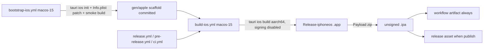

# Plan: Add iOS as a build target (unsigned `.ipa`), no regressions to Windows/Debian/Fedora/Android/macOS ARM64

Tauri 2 app (`@tauri-apps/cli` ^2.11.4, Tauri Rust `2`, wry 0.55.x). All changes are additive
and iOS-specific; no existing platform path is modified except additive wiring in CI
orchestrators and one additive branch in the frontend updater.

## Audit findings

**Already iOS-ready (no change needed):**

- [`src-tauri/src/lib.rs:21`](../src-tauri/src/lib.rs:21) has `#[cfg_attr(mobile, tauri::mobile_entry_point)]`; [`src-tauri/Cargo.toml:10`](../src-tauri/Cargo.toml:10) already builds `staticlib` (required by the iOS Xcode project).
- Rust deps (`ring` via rustls, `sqlx`/libsqlite3-sys, `axum`, `tokio`, `reqwest` rustls-no-provider, `zip`, `image` png-only, `local-ip-address`, `qrcode`, `uuid`) all support `aarch64-apple-ios`. **No `Cargo.toml`/`Cargo.lock` changes.**
- iOS icons already exist: `src-tauri/icons/ios/AppIcon-*.png` (full set).
- Frontend mobile handling already covers iOS: `viewport-fit=cover` in [`src/app.html:6`](../src/app.html:6); the `AndroidBridge` insets script in `app.html` no-ops when the bridge is absent; [`src/lib/utils/swipe.ts:188`](../src/lib/utils/swipe.ts:188) matches iPhone/iPad; `is-compact`/`is-mobile` hooks are capability-based.
- `tauri-plugin-updater` has no iOS support — but [`src/lib/services/updater.ts:114`](../src/lib/services/updater.ts:114) already maps `UnsupportedOs` to the `unsupported` error kind, and the mobile path (`manualInstallReason: 'mobile-platform'`) is platform-agnostic.
- Capabilities ([`src-tauri/capabilities/default.json`](../src-tauri/capabilities/default.json)) already resolve on mobile — proven by Android building today with the identical permission list (including `updater:*`). `fs:scope` `$APPDATA/$TEMP` map to the iOS app container.
- `.cargo/config.toml`'s `WRY_RUSTWEBVIEW_CLASS_EXTENSION` env is global but only substituted into wry's **Android** Kotlin template — inert on iOS, harmless elsewhere.
- Desktop-only code is already gated: `is_nvidia_wayland` is `#[cfg(target_os = "linux")]` ([`src-tauri/src/main.rs:15`](../src-tauri/src/main.rs:15)); the devtools plugin registration is under `debug_assertions` + feature.
- `db_path` uses `app_config_dir()` (iOS: `Library/Application Support`) — works.
- `backup.rs` `open_dest` only special-cases `content://` URIs (Android); iOS gets plain paths.

**Gaps this plan closes:**

1. No `src-tauri/gen/apple` Xcode scaffold — `tauri ios init` only runs on macOS; this machine is Linux.
2. Missing iOS permission/ATS metadata (Android manifest has equivalents): `NSCameraUsageDescription` (html5-qrcode), `NSLocalNetworkUsageDescription` + `NSAllowsLocalNetworking` (LAN sync server binds `0.0.0.0`, [`src-tauri/src/sync/server.rs:42`](../src-tauri/src/sync/server.rs:42); local LLM servers over `http://`), `ITSAppUsesNonExemptEncryption=false`.
3. No unsigned `.ipa` production path — the CLI's export phase assumes signing; signing must be disabled and the `.ipa` packaged manually.
4. CI has no iOS job; frontend updater looks only for `.apk` assets.
5. Docs don't cover iOS.

**Accepted limitations (to be reported, not silently dropped):**

- Local `tauri ios dev` with the `devtools` feature won't compile for iOS (`tauri-plugin-devtools` is desktop-only). Decision: no config change — iOS builds go through `tauri.release.conf.json` (features `[]`); document that local iOS dev must pass `--config src-tauri/tauri.release.conf.json`. Decision recorded by the user.
- iOS gets no background generation (Android's foreground service has no iOS equivalent) and no in-app updates (updater plugin unsupported; the existing `unsupported`/manual-install UX covers it).
- An unsigned `.ipa` cannot be installed with stock tooling — it targets sideloaders (AltStore/Sideloadly/TrollStore). README will say so.
- **Blocked on this Linux box:** `tauri ios init`, `tauri ios build`, and any Xcode/PlistBuddy step are macOS-only. Everything here is verified only as far as shell/YAML/TS static checks allow; the bootstrap workflow is the actual proof.

## Design decisions (confirmed with user)

- **Scaffold:** one-shot `bootstrap-ios.yml` (workflow_dispatch, macos-15) runs `npx tauri ios init`, patches Info.plist, smoke-tests the full unsigned build, and uploads `gen/apple` for a maintainer to commit — mirroring the tracked `gen/android` convention.
- **Publication:** full integration — new reusable `build-ios.yml` wired into `release.yml`, `pre-release.yml`, `ci.yml`; `.ipa` as release asset + workflow artifact.
- **Devtools:** no config/Rust change (see limitation above).

## Implementation steps

### 1. `scripts/build-ios-unsigned.sh` (new)

macOS-only (guard: `[[ "$(uname -s)" == Darwin ]] || exit 1`). Run from repo root (assert `src-tauri/tauri.conf.json` exists — `.cargo/config.toml` discovery depends on the working directory, same constraint documented for Android).

1. Forward `"$@"` (the `--config …` list from `.github/actions/build-version`) to the Tauri CLI, so the iOS version rule is the same single source as desktop/Android.
2. Export `CODE_SIGNING_ALLOWED=NO CODE_SIGNING_REQUIRED=NO CODE_SIGN_IDENTITY=` (xcodebuild inherits env; unsigned archive is Apple's documented technique).
3. Run `npx tauri ios build --target aarch64-apple-ios "$@"` **without** `--export-method`.
   - If the CLI (2.11.x) treats export as optional: clean exit after `xcodebuild archive`, `.app` is in the archive.
   - If it attempts an export and fails on the unsigned archive: tolerate **only** that failure mode — the archive/`.app` is already on disk. Do not blanket-ignore exit codes; capture and re-raise anything but an export/signing failure.
4. Locate the built `Aventuras.app` (glob, don't hardcode): newest match under `src-tauri/gen/apple/build/**/Release-iphoneos/*.app` and the archive's `Products/Applications/*.app`; fall back to `$HOME/Library/Developer/Xcode/DerivedData/Aventuras*/Build/Products/Release-iphoneos/*.app`. Fail with a clear message if none.
5. Package: `mkdir Payload && cp -R <app> Payload/ && zip -qry "Aventuras_v<version>_ios-arm64-unsigned.ipa" Payload` (version read with the same `node -p require(...)` trick as the build-version action).
6. Verify structurally (script exits non-zero on failure):
   - `unzip -l` shows `Payload/*.app/Aventuras` (binary), `Info.plist`, and the frontend assets;
   - `lipo -info` on the binary reports `arm64`;
   - `codesign -dv` reports the object is **not signed** (proves "unsigned" claim);
   - `plutil -p` on the packaged `Info.plist` shows the injected keys and the expected version/identifier.

### 2. `.github/workflows/bootstrap-ios.yml` (new)

`workflow_dispatch` only, `runs-on: macos-15` (pinned runner per [`docs/development/release.md`](../docs/development/release.md) runner-pinning rationale; Xcode 16.4). Steps: checkout → `./.github/actions/npm-install` → Rust stable + `aarch64-apple-ios` target → `npx tauri ios init` (add `--ci` to skip prompts if the CLI accepts it; if init turns out to require interactive input, that is reported, and the workflow gains a defaults-piped invocation) → run `scripts/build-ios-unsigned.sh --config src-tauri/tauri.release.conf.json` as a smoke test → PlistBuddy patch of `gen/apple/Info.plist` (see keys below) → upload two artifacts: `ios-xcode-scaffold` (entire `src-tauri/gen/apple`, **excluding** `build/`, `DerivedData/`, and anything the scaffold's own `.gitignore` covers) and the smoke-test `.ipa` (`ios-smoke-ipa`). Workflow header comment: run once, commit the scaffold, then delete or keep for tool upgrades.

### 3. `.github/workflows/build-ios.yml` (new reusable workflow)

Mirrors [`build-android.yml`](../.github/workflows/build-android.yml) structure: `workflow_call` inputs `prerelease` (default false) and `publish` (default true). Job on `macos-15`, `timeout-minutes: 60`, `env.CARGO_TERM_COLOR: always`:

checkout → npm-install → release-guard (if publish) → Rust stable with `targets: aarch64-apple-ios` → `swatinem/rust-cache@v2` (`workspaces: './src-tauri -> target'`, `key: ios`, `save-if: refs/heads/master`) → `.github/actions/build-version` → **scaffold guard** (fail with pointer to `bootstrap-ios.yml` if `src-tauri/gen/apple` is absent) → `scripts/build-ios-unsigned.sh ${{ steps.version.outputs.config-args }}` → `actions/upload-artifact@v7` (`name: ios-ipa`, `archive: false`) → if publish: `softprops/action-gh-release@v3` (`draft: true`, `prerelease:` input, tag `v${{ steps.version.outputs.version }}`, files: the `.ipa`). No signing secrets referenced anywhere.

### 4. Wire the orchestrators (additive only)

- [`release.yml`](../.github/workflows/release.yml): add `build-ios` job (`needs: create-release`, `uses: ./.github/workflows/build-ios.yml`, `with: prerelease: false`, `secrets: inherit`).
- [`pre-release.yml`](../.github/workflows/pre-release.yml): add same job with `prerelease: true`; extend the `publish` job to `needs: [create-release, build-desktop, build-android, build-ios]`.
- [`ci.yml`](../.github/workflows/ci.yml): add `build-ios` job with `publish: false` and the same `if:` version-bump guard; add `- 'src-tauri/gen/apple/**'` to the push `paths:` trigger.

### 5. Frontend updater (additive branch, no Android/desktop behavior change)

- [`src/lib/utils/platform.ts`](../src/lib/utils/platform.ts): add `isIos()` (`/iPad|iPhone|iPod/i` UA test, same style as `isAndroid()`; document the iPadOS-13+ desktop-UA caveat — matches the simplicity of the existing `swipe.ts` check).
- [`src/lib/services/updater.ts`](../src/lib/services/updater.ts): in the mobile check, pick the release asset by platform — `.apk` on Android, `.ipa` on iOS; everything else (timeout, `isNewerVersion`, `manualInstallReason: 'mobile-platform'`, `canInstallInApp: false`) is already platform-agnostic. Keep `check()` from the updater plugin reachable only on desktop exactly as today.

### 6. Docs

- [`docs/development/release.md`](../docs/development/release.md): new "Building iOS" section (unsigned by design, no Apple secrets, macos-15 pin, bootstrap-once flow, `.ipa` location, sideloading note, ATS/local-network/camera key rationale, the `tauri ios dev` devtools caveat); update the CI workflow list, the secrets paragraph (iOS needs none), runner-pinning note, and the updater section's "Android check" wording to "mobile check".
- [`README.md`](../README.md): iOS row in the install table (`Aventuras_vX.Y.Z_ios-arm64-unsigned.ipa`, sideload note); build-from-source paragraph mentions macOS + Xcode for iOS.
- [`docs/architecture/overview.md`](../docs/architecture/overview.md): add `gen/apple/` next to the existing `gen/android/` tree entry (tracked in git — do not overwrite).
- [`CLAUDE.md`](../CLAUDE.md): extend the "Things that bite" gen/android init warning to cover gen/apple.

## Files touched

| File | Change |
| --- | --- |
| `scripts/build-ios-unsigned.sh` | new |
| `.github/workflows/bootstrap-ios.yml` | new |
| `.github/workflows/build-ios.yml` | new |
| `.github/workflows/release.yml` | add `build-ios` job |
| `.github/workflows/pre-release.yml` | add `build-ios` job + extend `publish.needs` |
| `.github/workflows/ci.yml` | add `build-ios` job + path trigger |
| `src/lib/utils/platform.ts` | add `isIos()` |
| `src/lib/services/updater.ts` | asset picker branches apk/ipa |
| `docs/development/release.md`, `README.md`, `docs/architecture/overview.md`, `CLAUDE.md` | iOS documentation |
| `src-tauri/**` (Cargo.toml, Cargo.lock, tauri.conf.json, capabilities, Rust sources) | **deliberately untouched** |

## Verification & reporting

- Run on this machine: `npm run check`, `npm test`, `npm run lint`, `npm run build`, `bash -n` on the new script, `node --check` on nothing (no new JS), YAML sanity of new/edited workflows, and `cargo check` for the host target (proves no Rust regression; cannot prove iOS).
- Report explicitly as **untested/blocked**: `tauri ios init` behavior (prompting/`--ci`), the CLI 2.11 export-phase behavior with signing disabled, the unsigned `.ipa` end-to-end, Xcode/PlistBuddy paths, and the actual first CI run — all require the macos-15 runner. The `build-ios` legs will fail in CI until the bootstrap scaffold is committed; the guard step says so.
- Existing-platform regression surface is limited to the three orchestrator YAMLs (additive jobs) and the two TS files (additive branch guarded by UA checks) — desktop/Android code paths are byte-identical in behavior.
